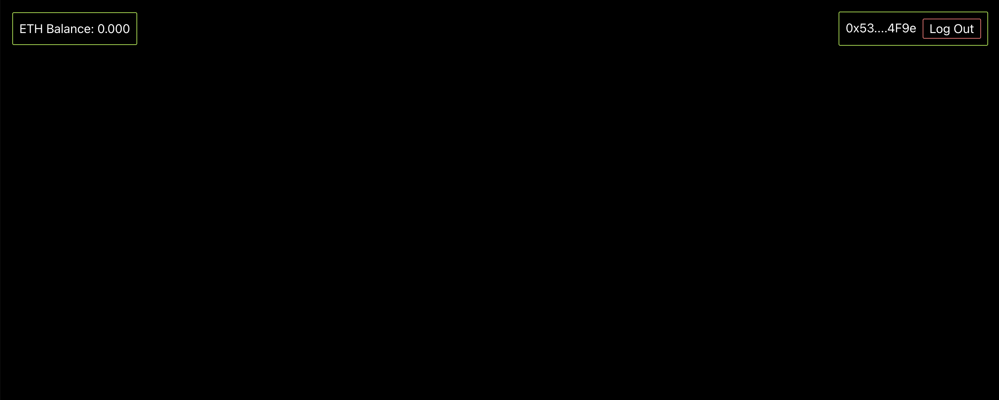

## web3-starter
---

### screenshot

### dependencies

- truffle
- ethers
- @web3-react
- cra + tailwindcss

### Contracts

- Run `yarn install` in project root to install Truffle build and smart contract dependencies
- Run local test net in port `7545` with an Ethereum client, e.g. Ganache
- `truffle migrate --network development`
- `truffle console --network development`
- Run tests in Truffle console: `test`

### Frontend

- `cd client`
- `yarn install`
- `yarn start`
- Open `http://localhost:3000`

### Refer
- Scaffold https://github.com/scaffold-eth/scaffold-eth
- 以太猫  https://www.cryptokitties.co/ 
- solidity https://docs.soliditylang.org/en/latest/
- Hardhat https://hardhat.org/tutorial/ 
- ethers https://docs.ethers.io/v5/
- Infura https://infura.io/ 